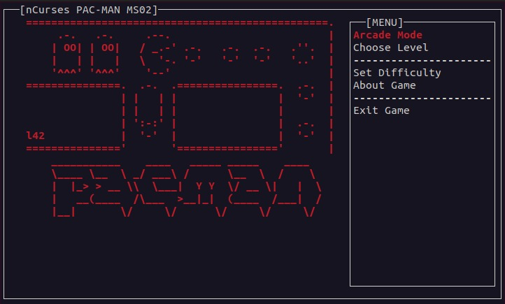
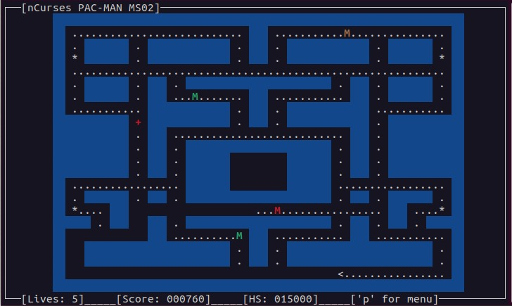
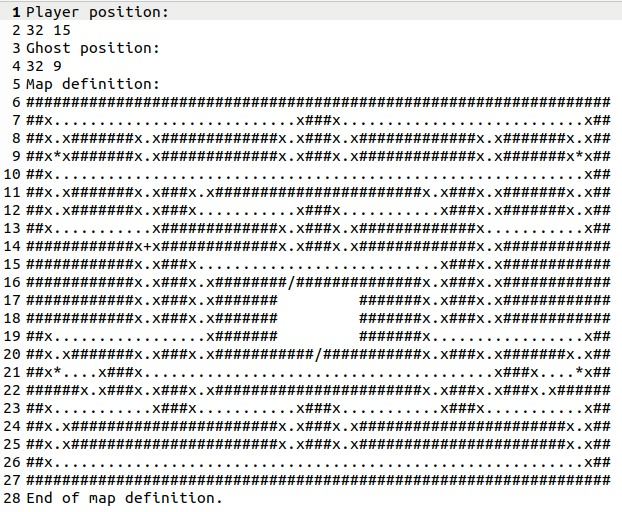

# ncursesPac 

ncurses pacman eschrieben in C++ für das Softwaretechnik Projekt.

## Screenshots

## Anwendung

Der folgende Shell-Befehl konfiguriert das System:

    $ make compile

Um zu spielen oder das Spiel zu testen:

    $ make run

## Abhängigkeiten

Das Spiel hängt nur von der `ncurses-Bibliothek` ab; sie wird verwendet, um grafische Dinge im Terminalfenster anzuzeigen.

In Arch-Linux wird sie standardmäßig mitgeliefert, in Debian-basierten Distributionen (Ubuntu) müssen Sie sie mit dem Befehl
`apt-get install libncurses5-dev` installieren.

Unter macOS heißt es `brew install ncurses`.

## Beschreibung der erfolgreichen Implementierung am Wochenende

Wir müssen den Rest des Codes hier beschreiben, da der Code am Freitag noch nicht fertig war.

Was wir noch geschafft haben, ist die Implementierung der `Mine`. Und dafür wurden die Klassen 
CBoard, CGame, CGhostManager und die defaul.pacmap Datei modifiziert.

Die Implementierung einer Klasse CMine war Fehlerfrei, aber wir konnten damit die Mine nicht 
im Spiel erscheinen lassen.

Wir haben also eine andere Alternative gefunden:\
Im Spiel gibt es große Punkte und wenn Pacman diese großen Punkte/Sterne isst, bekommt er die Fähigkeit, Geister zu essen.\
Wir haben die Implementierung dieser großen Punkte/Sterne benutzt, um die Mine zu implementieren.

    Wir haben zunächst das Zeichen '+' für die MIne in der Datei default.pacmap (Zeile 14) dargestellt.

    In der CBoard Klasse hanem wir die Funktion `bool is_mine ( int x, int y)` (Zeile 79-85) deklariert.
    `bool is_mine ( int x, int y)` hat als Parameter die ganzen Zahlen x und y, die die Koordinaten 
    der Mine auf der Karte darstellen und prüft, ob die Position (x, y) auf dem Spielbrett als `"mine" (+)` markiert ist. 

    Mit der Funktion `void draw ( CWindow * wind );` (Zeile 130-131) ändern wir die Farbe der Mine zu rot.

In CGame haben wir das Verhalten von Pacman implementiert, nachdem er über die Mine gegangen ist.\
Wenn Pacman über die Mine geht, wird diese aktiviert. Danach stirbt der Spieler, der ein zweites Mal auf die Mine tritt.

    In der Funktion  `void update ();` (Zeile 233-272) wurden zwei if-Bedingungen implementiert:\
    Die erste prüft, ob Pacman für das erste Mal über die Mine gegangen ist:
    `board -> is_mine ( player -> getX (), player -> getY () )`
    Die zweite prüft, ob Pacman für das zweite Mal über die Mine gegangen ist, 
    Wenn die zweite Bedingung zutrifft, verliert Pacman ein Leben.

In CGhostManager haben wir das Verhalten der Ghosts implementiert, nachdem sie die Mine durchquert haben.\
Die Ghosts sterben oder sind neu inisialisiert, wenn sie auf die Mine tretten nachdem Pacman die Mine schon getretten hat.
    Hier wurde die Funktion `void update ( CBoard * board, CPlayer * player );` modifitiert (Zeile 112-126 ).

    

    
